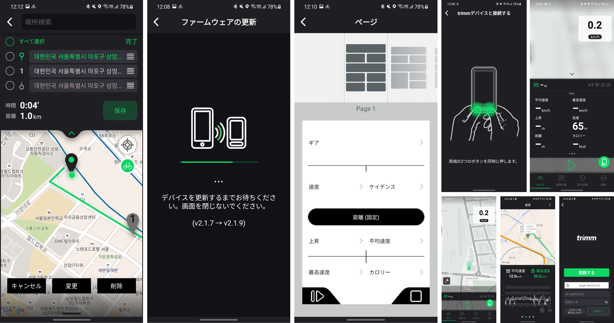

## 👋 안녕하세요! 안드로이드 개발자 문예지입니다.

#### 저는

- Kotlin으로 Android Native 앱을 개발하고 있습니다.
- 앱의 안정성을 높이기 위해 Jetpack, AAC, Coroutine, Flow 등 Android 최신 기술 동향에 지속적인 관심을 가지고 적용하고 있습니다.
- BLE(Bluetooth Low Energy)를 활용한 상용 앱을 개발 및 배포하고 관리한 경험이 있습니다.
- 팀의 목표를 위해 동료들과 소통하고 협력하는 것을 중요하게 여깁니다.
- 문제를 숨기지 않고 적극적으로 공유하며 책임감을 가지고 주어진 문제를 해결하고자 합니다.

## 🚀 이력 및 포트폴리오

    
자세히 보기

#### 주요 기술

#### 경력 및 활동

- 2021.06 – 2021.08 라인파이낸셜플러스㈜ 인턴
- 2018.12 – 2021.06 trimm Cycling Center Android 앱 개발
- 2020.04 – 2020.07 bpm Android 앱 개발

#### 학력

- 2015.03 – 2021.02 한국항공대학교 소프트웨어학과 졸업
- 2012.03 – 2015.01 한국디지털미디어고등학교 해킹방어과 졸업

#### 수상내역

- 2019.12 게임기획스터디 × 게임캠퍼스 제 4회 게임잼 우수상
- 2014.02 한국마이크로소프트 해커톤 ‘말햌’ 1위
- 2013.09 Windows 8 특성화고 앱 경진대회 한국마이크로소프트 사장상 (1위)

## 프로젝트

### 📌 trimm Cycling Center (2018.12 – 2021.06, 레이시오 유한책임회사)
  
> Android, Kotlin, Firebase, Google Maps Platform, Bluetooth LE, JNI Embedded, C language, Nordic nRF

trimm Cycling Center는 자전거 라이더를 위해 속도, 고도, 케이던스, 심박 등의 라이딩 정보를 Nordic 보드를 사용하는 전용 디바이스와 블루투스로 실시간 연동하여 사용자에게 제공하는 앱입니다. 앱에서의 라이딩 기록, 경로 계획 및 내비게이션, 전용 디바이스 또는 센서와 Bluetooth LE 연동 파트를 맡아서 개발하였습니다. 개발 외적으로는 12개국 언어로 로컬라이징 및 AOS 최종 배포를 담당하였습니다.

홈페이지: https://tirmm.bike  
앱 다운로드: https://play.google.com/store/apps/details?id=bike.trimm.rideWithMe

### 📌 bpm (2020.04 – 2020.07, BEATS PER MINUTE INC.)

> Android, Kotlin, Bluetooth LE, Google Maps Platform

bpm은 퀄컴 기반의 헬스케어 헤어 밴드 ‘run-up’과 블루투스로 연동하여 사용자의 심박수에 따라 비슷한 bpm을 가진 음악을 자동으로 재생하는 앱입니다. 사용자는 프로필을 설정하고 현재 심박수와 위치, 심박 기록 그래프를 확인할 수 있습니다.

### 📌 kingudom (2019.12)

> Android, Kotlin, Socket.io(WebSocket) + Node.js, React.js

kingudom은 PC게임의 컨트롤러를 게임패드나 키보드가 아닌 사용자가 가지고 있는 스마트폰으로 구현하여 모두가 쉽게 참여하고 즐길 수 있는 디펜스 게임입니다. 컨트롤러 앱은 WebSocket을 이용해서 실시간으로 공격 및 아이템 사용 등 스마트폰에서의 키 입력을 전송하고 사용자의 상태를 화면에 표시합니다. 상태에 따라 진동 등의 재미 요소를 추가하였습니다.

 
 게기스 4회 게임잼 해커톤 스케치영상

서비스(Web): https://github.com/connect-pad/connect-pad-rewind  
컨트롤러(Android): https://github.com/MiJey/Kingudom-Android

### 📌 덤벼라! (2018.05 – 2018.06)

> Embedded, C language, Nordic nRF, Android, Java, Bluetooth LE

덤벼라!는 블루투스 통신에 특화된 Nordic사의 nRF 보드를 사용하여 만든 2인용 격투 게임입니다. 보드 1개로 2명이서 플레이 할 수 있도록 블루투스로 연결된 AOS 앱을 2p 컨트롤러로 사용합니다. 1p 컨트롤러는 보드에 있는 버튼을 사용합니다. 사용자가 입력한 버튼에 따라 보드에 연결된 LCD 화면에 직접 그린 캐릭터가 움직입니다. 통신 프로토콜 및 간단한 물리 엔진을 직접 구현하였습니다.

보드(임베디드): https://github.com/MiJey/System-Programming  
컨트롤러(Android): https://github.com/MiJey/System-Programming-Android

